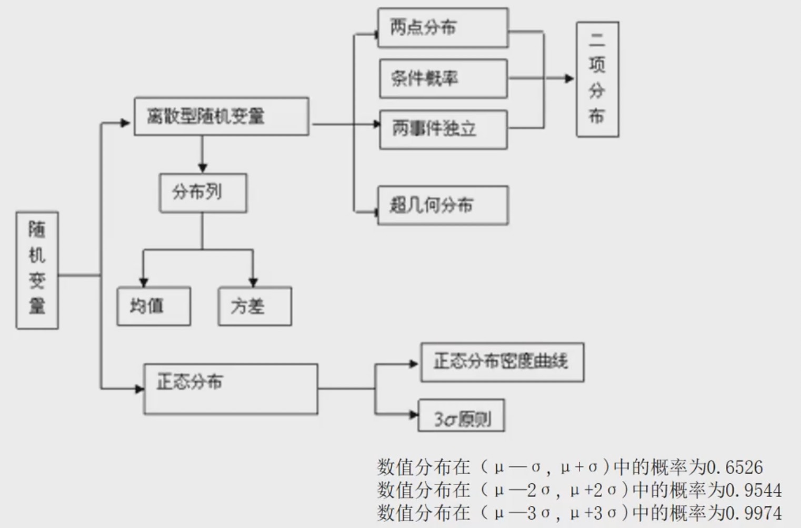
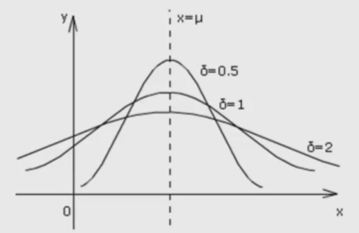

### 随机变量及其分布

1 ） **知识图谱**

    
     
    
备注：图片托管于github，请确保网络的可访问性

     

2 ） **相关概念**

- **随机变量**：如果随机试验的结果可以用一个变量来标识，那么这样的变量叫做随机变量。随机变量常用字母 $X, Y, \xi, \eta$ 等表示
- **离散型随机变量**：对于随机变量可能取的值，可以按一定次序一一列出，这样的随机变量叫做离散型随机变量.
- **连续型随机变量**：对于随机变量可能取的值，可以取某一区间内的一切值，这样的变量叫做连续型随机变量.
- **离散型随机变量与连续型随机变量的区别和联系**：离散型随机变量与连续型随机变量都是用变量表示随机试验的结果，但是离散型随机变量的结果可以按一定次序一一列出，而连续型随机变量的结果不可以一一列出
- 若X是随机变量，Y = aX + b (a,b是常数), 则Y也是随机变量，并且不改变其属性(离散型，连续型)

3 ） **离散型随机变量的分布列**

**概率分布(分布列)**

设离散型随机变量X可能取的不同值为 $x_1, x_2, ..., x_i, ..., x_n$，X的每一个值 $x_i$ (i = 1,2,...,n)的概率 $P(X=x_i) = p_i$, 则称下表为随机变量X的概率分布，简称X的分布列

<table>
    <tr>
        <td>X</td>
        <td>x1</td>
        <td>x2</td>
        <td>...</td>
        <td>xi</td>
        <td>...</td>
        <td>xn</td>
    </tr>    
    <tr>
        <td>P</td>
        <td>p1</td>
        <td>p2</td>
        <td>...</td>
        <td>pi</td>
        <td>...</td>
        <td>pn</td>
    </tr>
</table>

性质

- $p_i >= 0, i = 1,2,...,n;$
- $\sum_{i=1}^n p_i = 1$

**两点分布**

如果随机变量X的分布列为下表，则称X服从两点分布，并称p = P(X=1) 为成功概率

<table>
    <tr>
        <td>X</td>
        <td>0</td>
        <td>1</td>
    </tr>    
    <tr>
        <td>P</td>
        <td>1 - p</td>
        <td>p</td>
    </tr>
</table>

**二项分布**

- 如果一次实验中某时间发生的概率是p, 那么在n次独立重复实验中这个事件恰好发生k次的概率是 $P(X=k) = C_n^k p^k (1-p)^{n-k}$, 其中k=0,1,2,...,n, q = 1-p
- 于是得到随机变量X的概率分布如下
    * X: 0, 1, ..., k, ..., n
    * P: $C_n^0 p^0 q^n, C_n^1 p^1 q^{n-1}, ..., C_n^kp^kq^{n-k}, ..., C_n^n p^n q^0$
- 我们称这样的随机变量X服从二项分布，记为：$X ~ B(n,p)$, 并称 p 为成功概率
- 判断一个随机变量是否服从二项分布，关键有三点：
    * **对立性**: 即一次试验中事件发生与否二者必居其一
    * **重复性**: 即试验是独立重复地进行了n次
    * **等概率性**: 在每次试验中事件发生的概率相等
- 注意：二项分布的模型是有放回抽样，二项分布中的参数是p,k,n

4 ） **离散型随机变量的均值与方差**

**离散型随机变量的均值**

- 一般地，若离散型随机变量X的分布列为
    * X: $x_1, x_2, ..., x_i, ..., x_n$
    * P: $p_1, p_2, ..., p_i, ..., p_n$
- 则称 $E(X) = x_1 p_1 + x_2 p_2 + ... + x_i p_i + ... + x_n p_n$ 为离散型随机变量X的均值或者数学期望
- 它反映了离散型随机变量取值的平均水平

性质：

- $E(aX + b) = aE(x) + b$
- 若X服从两点分布，则$E(X) = p$
- 若X~B(n,p), 则$E(X) = np$

**离散型随机变量的方差**

- 一般地，若离散型随机变量X的分布列为：
    * X：$x_1, x_2, ..., x_i, ..., x_n$
    * P：$p_1, p_2, ..., p_i, ..., p_n$
- 则称 $D(x) = \sum_{i=1}^n (x_i - E(x))^2p_i$ 为随机变量X的方差，并称其算术平方根$\sqrt{D(X)}$为随机变量X的标准差
- 它反映了离散型随机变量取值的稳定与波动，集中与离散的程度
    * D(X)越小，X的稳定性越高，波动越小，取值越集中
    * D(X)越大，X的稳定性越差，波动越大，取值越分散

性质

- $D(aX+b) = a^2D(X)$
- 若X服从两点分布，则$D(X)=p(1-P)$
- 若X~B(n,p), 则$D(X) = np(1-P)$

5 ) **正态分布**

- 正态变量概率密度曲线函数表达式 $f(x) = \frac{1}{\sqrt{2 \pi} * \sigma} e^{- \frac{(x-\mu)^2}{2 \sigma^2}}, x \in R$
- 其中 $\mu, \sigma$是参数，且 $\sigma > 0, - \infty < \mu < + \infty$. 记为：$N(\mu, \sigma^2)$, 如下图

    
     
    
备注：图片托管于github，请确保网络的可访问性

     

- 若随机变量X服从一个数学期望为μ、方差为$σ^2$的正态分布，记为$N(μ，σ^2)$
- 其概率密度函数为正态分布的期望值μ决定了其位置，其标准差σ决定了分布的幅度
- 当μ = 0,σ = 1时的正态分布是标准正态分布